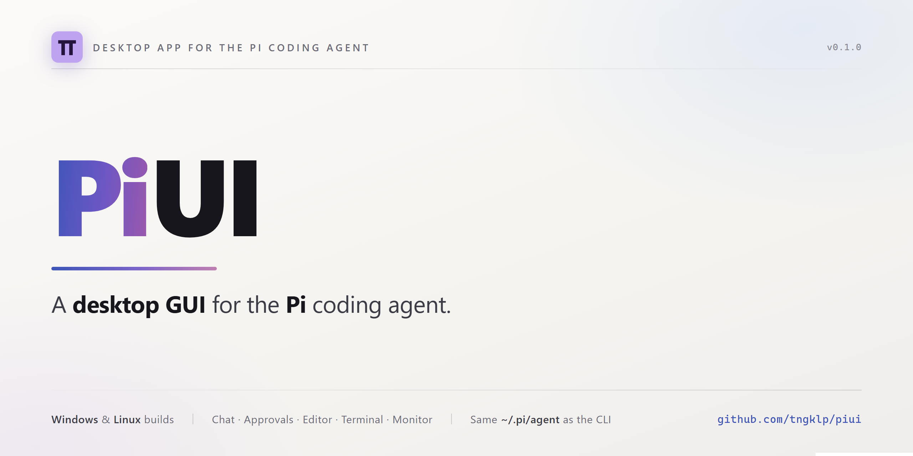
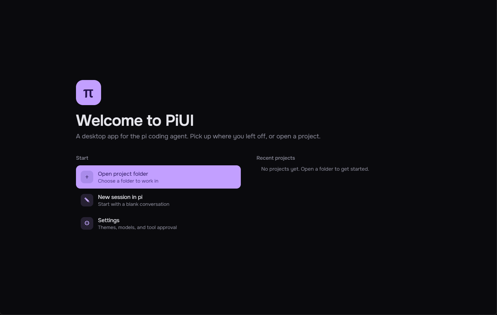
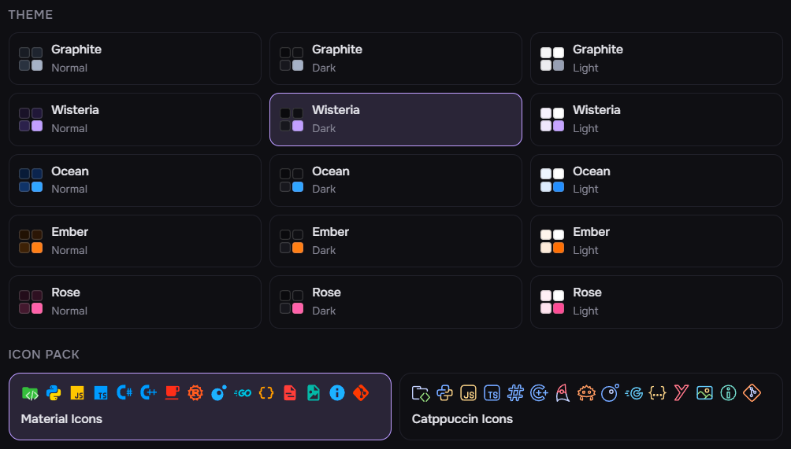
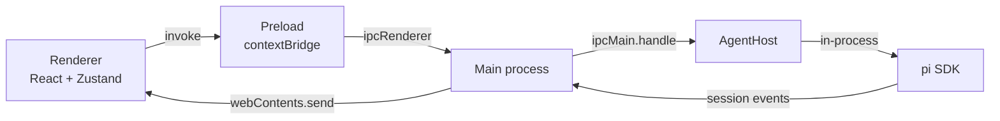

# PiUI



[](https://github.com/tngklp/piui/actions/workflows/ci.yml)
[](https://github.com/tngklp/piui/releases/latest)
[](LICENSE)

A desktop GUI for the [Pi](https://pi.dev) coding agent - run your Pi agent in
a purpose-built app instead of a terminal.

[**Download for Windows**](https://github.com/tngklp/piui/releases/download/v0.1.0/PiUI-0.1.0-x64-setup.exe)
&nbsp;·&nbsp;
[**Download for Linux**](https://github.com/tngklp/piui/releases/download/v0.1.0/PiUI-0.1.0-x86_64.AppImage)
&nbsp;·&nbsp;
[All releases](https://github.com/tngklp/piui/releases)

PiUI embeds the Pi agent runtime directly in an Electron main process and presents it through a
React interface. It shares the same agent directory (`~/.pi/agent`) as the `pi` CLI, so settings,
credentials, skills, models, and sessions are common to both. Anything you change in PiUI shows up
in the CLI and vice versa.

## Contents

- [Features](#features)
- [Screenshots](#screenshots)
- [Requirements](#requirements)
- [Install](#install)
- [Getting started](#getting-started)
- [How it works](#how-it-works)
- [Configuration](#configuration)
- [Troubleshooting](#troubleshooting)
- [Known issues and roadmap](#known-issues-and-roadmap)

## Features

**Chat**

- Streaming transcript with markdown, syntax highlighting, KaTeX maths, and collapsible reasoning
  blocks.
- Tool calls render as cards showing the command, the diff, or the output, with a duration.
- Model and reasoning-effort pickers in the composer, plus a slash menu for commands, skills, and
  prompt templates.
- Attach images (sent as image blocks) or text files (inlined into the prompt).
- Steer a running turn, or queue a follow-up, without waiting for it to finish.

**Approvals**

- Per-tool policy - allow, ask, or deny - so anything that runs a command or writes a file can
  pause for review. Approvals appear inline in the transcript rather than as a modal.

**Sessions**

- Session browser grouped by date, with pinning, starring, renaming, forking, and deletion.
- Workspace switching with a native folder picker; sessions are grouped by working directory.

**Workspace**

- File explorer with selectable icon packs (Material Icons or Catppuccin Icons).
- CodeMirror 6 editor with tabs, search, autocomplete, indent guides, format-on-save (Prettier),
  and optional auto save.
- Real terminal (xterm.js over a `node-pty` shell) that keeps running while you switch tabs.
- Quick open (`Ctrl+P`) across the whole workspace.
- Monitor tab with live inference telemetry (tokens per second, prompt progress, KV cache), GPU
  load and VRAM, and host CPU and memory.

**Customization**

- Fifteen themes: five families (Graphite, Wisteria, Ocean, Ember, Rose) each in a normal, dark,
  and light variant.
- Settings for the agent, terminal, editor, models, icon packs, packages, and approval policy.

**Updates**

- Installed builds check the GitHub releases feed on launch and offer a download-and-restart prompt.

## Screenshots





## Requirements

- **Node.js >= 22.19** - required by Pi's SDK, and by the build.
- **The `pi` CLI**, installed and on `PATH`. PiUI loads the SDK from your installed release, so the
  app and the CLI always agree on behaviour.
- **A model to talk to.** Either a hosted API (OpenAI, Anthropic, DeepSeek, Gemini, xAI, Mistral,
  Groq, OpenRouter - add one under **Settings → Models**), or a local
  [llama.cpp](https://github.com/ggerganov/llama.cpp) server:

  ```sh
  llama-server -m model.gguf --port 8080 --metrics
  ```

  `--metrics` is what the Monitor tab reads; without it the tab explains that the endpoint publishes
  no telemetry.

Install Pi with:

```sh
# Windows
powershell -c "irm https://pi.dev/install.ps1 | iex"

# macOS / Linux
curl -fsSL https://pi.dev/install.sh | sh
```

## Install

Download the latest release from the
[releases page](https://github.com/tngklp/piui/releases):

| Platform | Download                          | Notes                                                             |
| -------- | --------------------------------- | ----------------------------------------------------------------- |
| Windows  | `PiUI-<version>-x64-setup.exe`    | Installer. Supports in-app updates, launches instantly.           |
| Windows  | `PiUI-<version>-x64.zip`          | Unzip once, run `PiUI.exe`.                                       |
| Windows  | `PiUI-<version>-x64-portable.exe` | One file, nothing to install. Re-extracts itself on every launch. |
| Linux    | `PiUI-<version>-x86_64.AppImage`  | Supports in-app updates.                                          |
| Linux    | `PiUI-<version>-amd64.deb`        | Reinstall to update.                                              |

The Windows builds are not code-signed yet, so the first launch may show **"Windows protected your
PC"**. Choose **More info** and then **Run anyway**. That prompt is expected for any freshly
downloaded unsigned build, and only goes away with a code-signing certificate.

## Getting started

1. Launch PiUI. The first screen offers your recent workspaces; pick a folder to work in. Everything
   the agent does happens inside that directory.
2. Open **Settings → Models** and add a provider. Choose one from the list to add a hosted API (then
   paste your API key), or add a custom provider for a local endpoint such as
   `http://127.0.0.1:8080/v1`. Press **Add model** to pick from the provider's catalogue.
3. Back in the chat, choose the model in the composer and send a message.

## How it works

The renderer never touches Node or the SDK. The main process owns the agent and streams typed events
over IPC:



A few decisions worth knowing:

- **The SDK is loaded from the installed `pi` release** (`src/main/pi/sdk.ts`) rather than from
  PiUI's own pinned copy, so the app cannot drift from the CLI. It falls back to the bundled copy if
  no release is found.
- **Approvals are an inline pi extension** hooking `tool_call`, rather than something built on
  `ctx.ui`. PiUI only implements the UI context members it needs.
- **The agent directory is shared.** `models.json`, credentials, skills, and sessions all live under
  `~/.pi/agent`; PiUI edits them in place and preserves keys it does not understand.
- **Hosted providers are treated differently from local ones.** An entry in `models.json` overlays
  pi's built-in provider rather than replacing it, so a hosted provider would otherwise inherit its
  entire built-in catalogue. PiUI hides the model fields the API owns and lists only the models you
  added.
- **`--metrics` is a local-engine feature.** Hosted APIs do not publish inference telemetry, so the
  Monitor tab only has data when the model runs on a llama.cpp-style server you can reach.

## Configuration

| What               | Where                                                    |
| ------------------ | -------------------------------------------------------- |
| Providers & models | `<agentDir>/models.json`, via **Settings → Models**      |
| Tool approvals     | `userData/approval-rules.json`, via **Settings → Tools** |
| Workspace          | `userData/workspace.json`                                |
| Theme, prefs       | `localStorage` in the renderer                           |
| Agent directory    | `PI_CODING_AGENT_DIR`, default `~/.pi/agent`             |
| Default workspace  | `PIUI_CWD`, default your home directory                  |
| Terminal shell     | **Settings → General**, or the `PIUI_SHELL` env var      |

The terminal shell is a whole command, not just a path, so it can start something other than a
local shell - `docker exec -it pi bash`, `wsl.exe -d Ubuntu`, `ssh devbox`.

## Troubleshooting

**PiUI cannot find `pi`.** PiUI loads the agent SDK from your installed `pi` release, so `pi` has to
be on `PATH` for the shells PiUI spawns. Install it with the command in
[Requirements](#requirements) and restart PiUI. If `pi` is installed somewhere unusual, point PiUI
straight at the agent directory with `PI_CODING_AGENT_DIR`.

**The Monitor tab says the endpoint publishes no telemetry.** It reads a local llama.cpp server, and
that server only reports metrics when it is started with `--metrics`:

```sh
llama-server -m model.gguf --port 8080 --metrics
```

Hosted APIs never report inference telemetry, so the tab stays empty for them by design.

**Windows says "Windows protected your PC".** SmartScreen warns about any freshly downloaded,
unsigned installer. Choose **More info**, then **Run anyway**. See the note under
[Install](#install) for why that is expected and what removes it.

**A tool call looks stuck.** Long commands stream their output as it arrives, so a card that stays
empty for a while is usually a command with nothing to print yet. Press **Esc** or use the stop
button to cancel the turn.

## Known issues and roadmap

### Known issues

- **The Windows builds are unsigned**, so SmartScreen warns on the first launch. A certificate is
  the only fix.
- **The portable build unpacks the whole application on every launch** (several hundred megabytes),
  so it takes a few seconds to start. The installer and the zip build do not.
- **PDFs and other binary files cannot be attached to a prompt.** The agent's prompt API accepts
  text and images only, so the attach button refuses them, and a binary file dropped on the composer
  is rejected with an explanation. They can still be opened in the editor.
- **Only images, PDFs, and markdown get a viewer.** Any other binary file (a `.zip`, an executable)
  opens in the text editor and shows garbled characters.
- **In-app update support depends on the build.** The Windows installer and the Linux AppImage can
  update themselves; the portable build and the `.deb` report that they cannot.

### Roadmap

- MCP server support, so PiUI can drive external tool servers.
- Exporting and importing sessions, for moving a conversation between machines.
- Authoring skills and prompt templates from inside the app rather than only installing them.
- Showing release notes in the in-app update prompt.
