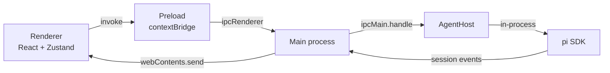

# PiUI

A desktop GUI for the [Pi](https://pi.dev) coding agent — run your Pi agent in
a purpose-built app instead of a terminal.

PiUI embeds the Pi agent runtime directly in an Electron main process and presents it through a
React interface. It shares the same agent directory (`~/.pi/agent`) as the `pi` CLI, so settings,
credentials, skills, models, and sessions are common to both. Anything you change in PiUI shows up
in the CLI and vice versa.

## Contents

- [Features](#features)
- [Requirements](#requirements)
- [Install](#install)
- [Getting started](#getting-started)
- [Development](#development)
- [Project layout](#project-layout)
- [How it works](#how-it-works)
- [Releasing](#releasing)
- [Troubleshooting](#troubleshooting)
- [License](#license)

## Features

**Chat**

- Streaming transcript with markdown, syntax highlighting, KaTeX maths, and collapsible reasoning
  blocks.
- Tool calls render as cards showing the command, the diff, or the output, with a duration.
- Model and reasoning-effort pickers in the composer, plus a slash menu for commands, skills, and
  prompt templates.
- Attach images (sent as image blocks) or text files (inlined into the prompt).
- Steer a running turn, or queue a follow-up, without waiting for it to finish.

**Approvals**

- Per-tool policy — allow, ask, or deny — so anything that runs a command or writes a file can
  pause for review. Approvals appear inline in the transcript rather than as a modal.

**Sessions**

- Session browser grouped by date, with pinning, starring, renaming, forking, and deletion.
- Workspace switching with a native folder picker; sessions are grouped by working directory.

**Workspace**

- File explorer with selectable icon packs (Material Icons or Catppuccin Icons).
- CodeMirror 6 editor with tabs, search, autocomplete, indent guides, format-on-save (Prettier),
  and optional auto save.
- Real terminal (xterm.js over a `node-pty` shell) that keeps running while you switch tabs.
- Quick open (`Ctrl+P`) across the whole workspace.
- Monitor tab with live inference telemetry (tokens per second, prompt progress, KV cache), GPU
  load and VRAM, and host CPU and memory.

**Customization**

- Fifteen themes: five families (Graphite, Wisteria, Ocean, Ember, Rose) each in a normal, dark,
  and light variant.
- Settings for the agent, terminal, editor, models, icon packs, packages, and approval policy.

**Updates**

- Installed builds check the GitHub releases feed on launch and offer a download-and-restart prompt.

## Requirements

- **Node.js >= 22.19** — required by Pi's SDK, and by the build.
- **The `pi` CLI**, installed and on `PATH`. PiUI loads the SDK from your installed release, so the
  app and the CLI always agree on behaviour.
- **A model to talk to.** Either a hosted API (OpenAI, Anthropic, DeepSeek, Gemini, xAI, Mistral,
  Groq, OpenRouter — add one under **Settings → Models**), or a local
  [llama.cpp](https://github.com/ggerganov/llama.cpp) server:

  ```sh
  llama-server -m model.gguf --port 8080 --metrics
  ```

  `--metrics` is what the Monitor tab reads; without it the tab explains that the endpoint publishes
  no telemetry.

Install Pi with:

```sh
# Windows
powershell -c "irm https://pi.dev/install.ps1 | iex"
# macOS / Linux
curl -fsSL https://pi.dev/install.sh | sh
```

## Install

Download the latest release from the
[releases page](https://github.com/tngklp/piui/releases):

| Platform | Download                          | Notes                                                   |
| -------- | --------------------------------- | ------------------------------------------------------- |
| Windows  | `PiUI-<version>-x64-setup.exe`    | Installer. Supports in-app updates.                     |
| Windows  | `PiUI-<version>-x64-portable.exe` | Single file, no install. Cannot self-update, by design. |
| Linux    | `PiUI-<version>-x64.AppImage`     | Supports in-app updates.                                |
| Linux    | `PiUI-<version>-x64.deb`          | Reinstall to update.                                    |

macOS is not packaged yet.

## Getting started

1. Launch PiUI. The first screen offers your recent workspaces; pick a folder to work in. Everything
   the agent does happens inside that directory.
2. Open **Settings → Models** and add a provider. Choose one from the list to add a hosted API (then
   paste your API key), or add a custom provider for a local endpoint such as
   `http://127.0.0.1:8080/v1`. Press **Add model** to pick from the provider's catalogue.
3. Back in the chat, choose the model in the composer and send a message.
4. When the agent wants to run a tool, an approval card appears in the transcript — unless you
   changed the policy in **Settings → Tools**.

## Development

```sh
npm install
npm run dev          # launch with HMR
npm run typecheck    # type-check main/preload and renderer
npm run build        # type-check, then build to out/
npm run format       # Prettier
npm run smoke        # load the SDK the way the app does, without a window
```

`npm install` may not run lifecycle scripts depending on your npm configuration. If `npm run dev`
fails with `Error: Electron uninstall`, run `node node_modules/electron/install.js` once.

Packaging:

```sh
npm run build:win     # Windows setup + portable
npm run build:linux   # AppImage + deb
npm run build:unpack  # unpacked directory, for inspecting the bundle
```

## Project layout

```
assets/           generated app icon (from scripts/make-icon.mjs)
build/            electron-builder build resources (generated icon)
scripts/          build-time helpers: icon generation, icon packs, SDK smoke test
src/main/         Electron main process: window, IPC, packaging concerns
  pi/             the agent host: SDK loading, sessions, models, approvals, packages
src/preload/      the contextBridge API exposed to the renderer as window.piui
src/renderer/     the React UI
  src/components/  UI, split into settings/, panels/, editor/
  src/lib/         renderer-side helpers (preferences, attachments, icon packs)
  src/theme/       the theme registry
src/shared/       the IPC contract and DTOs, imported by both sides
```

`assets/icon.png`, `build/icon.png`, and the icon packs under
`src/renderer/public/*-icons/` are **generated**, and therefore gitignored. `npm run assets`
regenerates them and runs automatically before `dev` and `typecheck`, so a fresh clone builds
without them. The `scripts/` directory is committed because those generators are the source.

## How it works

The renderer never touches Node or the SDK. The main process owns the agent and streams typed events
over IPC:



A few decisions worth knowing:

- **The SDK is loaded from the installed `pi` release** (`src/main/pi/sdk.ts`) rather than from
  PiUI's own pinned copy, so the app cannot drift from the CLI. It falls back to the bundled copy if
  no release is found.
- **Approvals are an inline pi extension** hooking `tool_call`, rather than something built on
  `ctx.ui`. PiUI only implements the UI context members it needs.
- **The agent directory is shared.** `models.json`, credentials, skills, and sessions all live under
  `~/.pi/agent`; PiUI edits them in place and preserves keys it does not understand.
- **Hosted providers are treated differently from local ones.** An entry in `models.json` overlays
  pi's built-in provider rather than replacing it, so a hosted provider would otherwise inherit its
  entire built-in catalogue. PiUI hides the model fields the API owns and lists only the models you
  added.
- **`--metrics` is a local-engine feature.** Hosted APIs do not publish inference telemetry, so the
  Monitor tab only has data when the model runs on a llama.cpp-style server you can reach.

## Configuration

| What               | Where                                                    |
| ------------------ | -------------------------------------------------------- |
| Providers & models | `<agentDir>/models.json`, via **Settings → Models**      |
| Tool approvals     | `userData/approval-rules.json`, via **Settings → Tools** |
| Workspace          | `userData/workspace.json`                                |
| Theme, prefs       | `localStorage` in the renderer                           |
| Agent directory    | `PI_CODING_AGENT_DIR`, default `~/.pi/agent`             |
| Default workspace  | `PIUI_CWD`, default your home directory                  |
| Terminal shell     | **Settings → General**, or the `PIUI_SHELL` env var      |

## Releasing

Releases are built by hand — pushing a tag does not publish anything.

1. Bump `version` in `package.json` and commit it.
2. Run the **Release** workflow from the Actions tab, or `npm run release` locally.
3. The run uploads the setup and portable `.exe` files, the Linux packages, and the `latest.yml`
   metadata the updater reads to a **draft** GitHub release.
4. Review the draft and publish it. Publishing is the moment installed copies start seeing the
   update, since the app reads the releases feed on launch.

To publish automatically on tags instead, add a `push: tags: ['v*']` trigger to
`.github/workflows/release.yml` and switch `releaseType` to `release` in `electron-builder.yml`.

## Troubleshooting

**"No model" and an empty model picker.** `models.json` failed to load. The most common cause is an
empty `apiKey`: pi's schema requires at least one character when the key is present, and one invalid
field invalidates the whole file. The Models tab shows the exact reason — remove the empty key or
fill it in.

**The Monitor tab says the endpoint publishes no telemetry.** Expected for hosted APIs. Start a
local llama.cpp server with `--metrics` to see inference data.

**A hosted model is missing from the picker.** Only models you added from the provider's catalogue
are offered; that is deliberate. Add the model under **Settings → Models**.

**Format on save does nothing.** Prettier only formats languages it can infer a parser for from the
file name, and it respects the project's own `.prettierrc` (including `ignore` rules). Files it
cannot handle are saved unchanged.

**A PDF cannot be attached.** The agent's prompt API accepts text and images only — there is no
document block to send a PDF in, and inlining one would produce binary noise. Paste the text, or
attach an image of the page.

## License

MIT — see [LICENSE](LICENSE).
